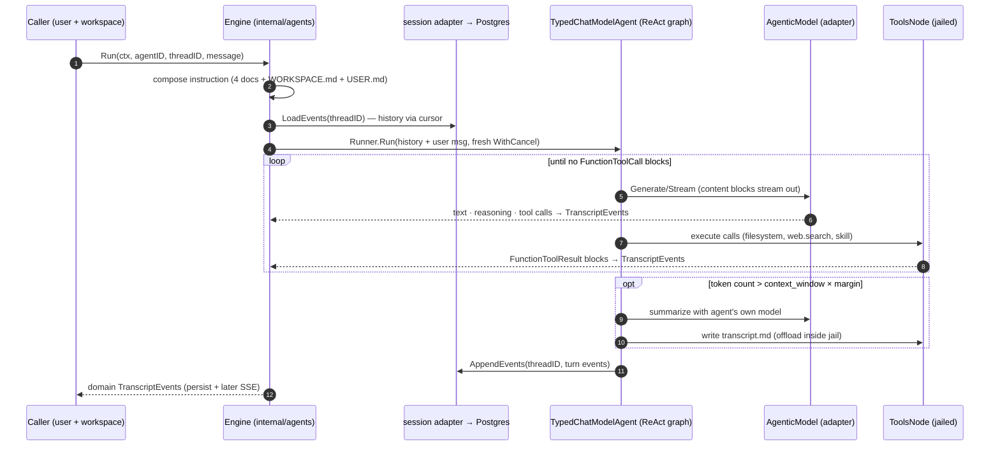

# Agent Runtime Architecture

Consolidated design from the exploration session (2026-09-01). Scope: the agent
execution runtime inside `internal/agents/`; the chat/SSE API is a later scope.

Key decisions captured here:

- Eino `v0.10.0-alpha.28` ADK, agentic path (`TypedChatModelAgent[*schema.AgenticMessage]`)
- `Engine` port hides all Eino types behind domain transcript events
- Streaming-first: the agent responds via deltas (`TextDelta`/`ReasoningDelta` are transient; completed messages persist)
- One filesystem knob: `ONCLAW_DIR` (default `~/.onclaw`)
- Skills: three directory tiers — system (embedded, re-synced on start), workspace, agent (inside the agent's jailed dir); precedence agent > workspace > system; system tier ignores `disabled_skills`
- Denylist model: `disabled_tools` / `disabled_skills` / `disabled_mcps` replace the old allowlist fields
- System prompt: `AGENTS.md` + `IDENTITY.md` + `SOUL.md` + `WORKSPACE.md` (virtual: workspace name + description) + `USER.md` (virtual: caller name + email + role) + `BOOTSTRAP.md`
- Context window: nullable `agents.context_window`, auto-filled from the models.dev catalog (`limit.context`), fallback default 200k, user-overridable; drives the summarization trigger
- Summarization uses the agent's own model and offloads full history to `transcript.md` inside the agent dir
- Session persistence: eino-free `session_events` table in Postgres; the `adk/session` adapter (events + checkpoints) lives in `internal/agents`

## Component architecture

```mermaid
flowchart TB
    classDef deferred stroke-dasharray:4 4,opacity:0.55
    classDef onclaw fill:#eef4ff,stroke:#2f6feb
    classDef eino fill:#f3f0ff,stroke:#7c5cff
    classDef adapt fill:#fff7e8,stroke:#d97706
    classDef store fill:#f0faf0,stroke:#2f9e44

    subgraph APP["OnClaw · internal/agents"]
        ENGINE["Engine port<br/>Run ctx, ExecRequest → domain TranscriptEvents<br/>(Eino types never escape)"]:::onclaw
        COMPOSER["Instruction composer · per execution<br/>AGENTS.md + IDENTITY.md + SOUL.md<br/>+ WORKSPACE.md virtual<br/>+ USER.md virtual · varies by caller<br/>+ BOOTSTRAP.md"]:::onclaw
        FACTORY["Agentic model factory<br/>openai / openrouter / oa-compat → agenticopenai<br/>anthropic / a-compat → agenticclaude<br/>gemini → agenticgemini"]:::onclaw
        REGISTRY["Tool registry · denylist disabled_tools<br/>built-in: web.search (provider stack, 3-deep failover)"]:::onclaw
        SKILLRES["Skills resolver<br/>tiers: agent > workspace > system<br/>system tier ignores disabled_skills"]:::onclaw
        SESSAD["adk/session adapter<br/>serializes events + checkpoints"]:::onclaw
    end

    subgraph EINO["Eino ADK v0.10.0-alpha.28 · M = AgenticMessage"]
        RUNNER["Runner<br/>EnableStreaming · fresh WithCancel per run"]:::eino
        AGENT["TypedChatModelAgent[AgenticMessage]"]:::eino
        REACT["internal ReAct graph<br/>init → chatModel → branch → cancelCheck<br/>→ ToolsNode → loop → afterAgent"]:::eino
        MW["Handlers, in order:<br/>patchtoolcalls → reduction → summarization<br/>→ skill → filesystem"]:::eino
    end

    subgraph EXT["eino-ext"]
        A_OAI["agenticopenai"]:::adapt
        A_CLA["agenticclaude"]:::adapt
        A_GEM["agenticgemini"]:::adapt
        MCPT["MCP tools"]:::deferred
    end

    subgraph DISK["Filesystem · single knob ONCLAW_DIR (default ~/.onclaw)"]
        SYSSK["skills/<br/>SYSTEM tier · embedded assets<br/>mirrored on every server start"]:::store
        WSK["workspaces/TENANT/skills/<br/>WORKSPACE tier"]:::store
        AGJAIL["workspaces/TENANT/agents/SLUG/<br/>AGENT jail · all model file access stops here<br/>AGENTS.md · IDENTITY.md · SOUL.md · BOOTSTRAP.md<br/>skills/ (agent-authored) · transcript.md (summarization offload)"]:::store
    end

    subgraph PG["Postgres"]
        SE["session_events<br/>transcript events + interrupt checkpoints"]:::store
        AGT["agents<br/>context_window · disabled_tools/skills/mcps"]:::store
        WST["workspaces<br/>name · description · timezone"]:::store
        UMT["users + workspace_members<br/>name · email · role"]:::store
        CAT["models.dev catalog cache<br/>limit.context"]:::store
    end

    ENGINE --> RUNNER
    RUNNER --> AGENT
    AGENT --> REACT
    MW -.->|"injects tools + wraps model/tool calls"| AGENT

    FACTORY --> A_OAI
    FACTORY --> A_CLA
    FACTORY --> A_GEM
    A_OAI --> PV["provider REST APIs (streamed blocks)"]
    A_CLA --> PV
    A_GEM --> PV
    MCPT -.-> REGISTRY

    COMPOSER --> ENGINE
    COMPOSER -->|"reads 4 docs"| AGJAIL
    COMPOSER -->|"renders WORKSPACE.md"| WST
    COMPOSER -->|"renders USER.md per caller"| UMT
    FACTORY --> ENGINE
    REGISTRY --> ENGINE
    SKILLRES -->|"skill tool source"| MW
    SKILLRES --> SYSSK
    SKILLRES --> WSK
    SKILLRES --> AGJAIL
    MW -->|"ls read write edit glob grep<br/>jailed to agent dir · no shell"| AGJAIL
    MW -->|"summary trigger =<br/>context_window × margin"| AGT
    MW -->|"offloads full history"| AGJAIL

    ENGINE -->|"model config + creds"| FACTORY
    SESSAD <--> ENGINE
    SESSAD <-->|"events + checkpoints"| SE
    RUNNER -->|"AsyncIterator events"| ENGINE
    AGT -->|"resolved window"| ENGINE
    CAT -.->|"auto-fill on create/update<br/>fallback when unset: 200k"| AGT
```



## Streaming contract

The agent responds on streaming. The Engine port is delta-capable so the later
SSE layer is a passthrough:

```go
Run(ctx context.Context, req ExecRequest) *EventStream // yields TranscriptEvents
```

| TranscriptEvent | Source | Persisted? |
|---|---|---|
| `TurnStarted` | `session.status_running` | yes |
| `TextDelta` / `ReasoningDelta` | streamed content-block chunks | no — transient, UI only |
| `ToolCallRequested` | complete `FunctionToolCall` block | yes |
| `ToolCallStarted` / `ToolCallFinished{latency}` | `span.tool_call_start/end` | yes |
| `MessageCompleted{content}` | assembled message at stream end | yes — the persisted message |
| `ContextCompacted` | `messages_replaced` | yes |
| `TurnCompleted` / `Error` / `Cancelled` | `status_idle` / `session.error` / `cancel` | yes |
| `Retrying` | `WillRetryError` (if model retry configured) | no |

Rules:

1. Deltas are never persisted; the Runner logs the completed `message`. A stream
   interrupted mid-flight logs `message_stream_incomplete` so reloads render the
   partial response from durable data alone.
2. Every `StreamReader` consumed by the Engine closes via `defer stream.Close()`.
3. Tool calls arrive complete (args finish streaming) before execution.
4. Cancel uses a safe-point mode (`CancelAfterChatModel`) so the visible partial
   response matches what persists.

## One execution, end to end


