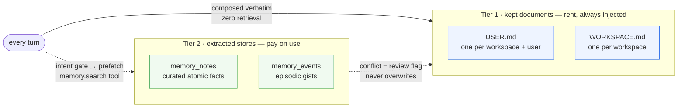
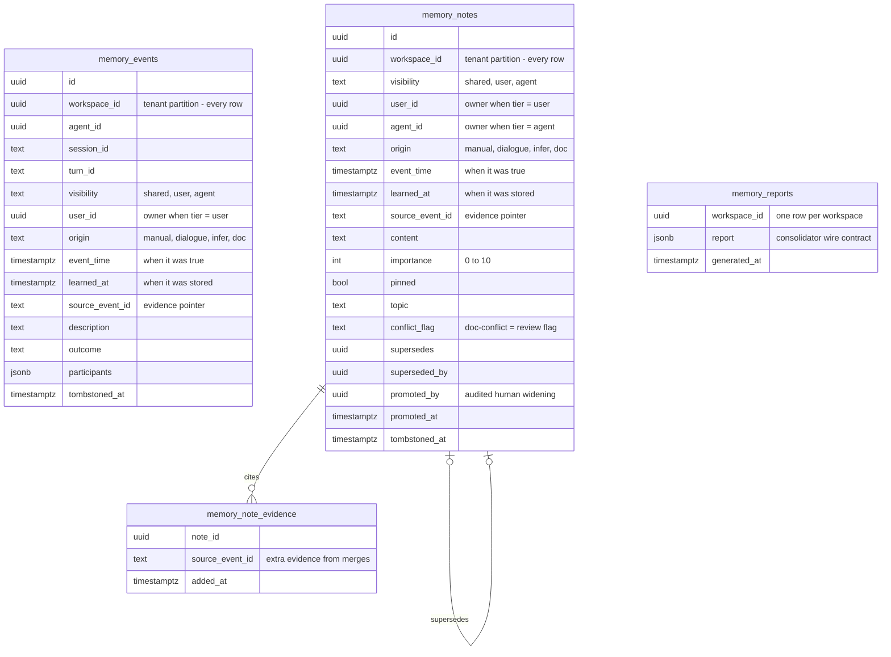
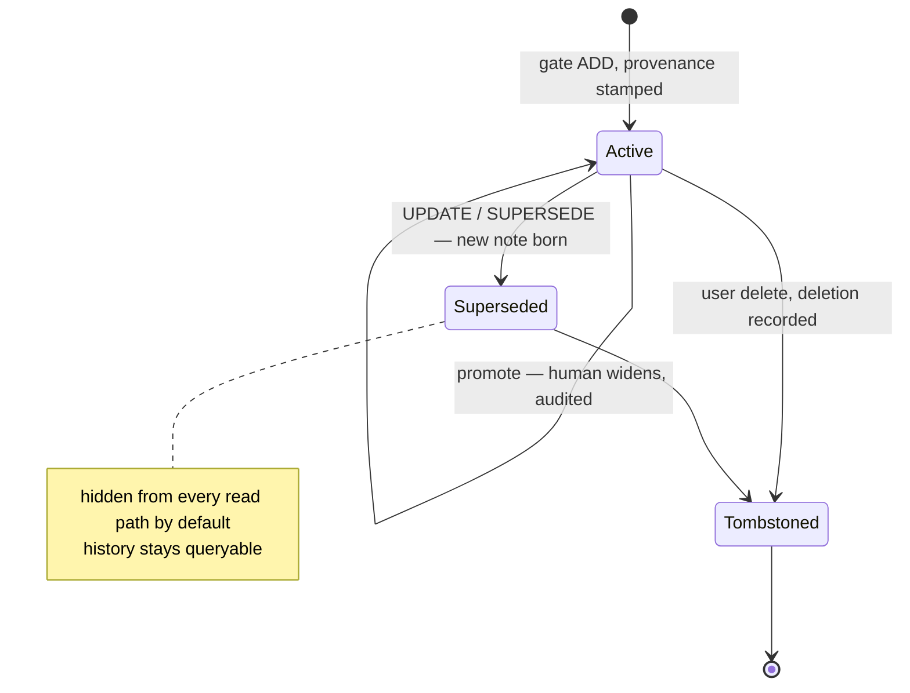
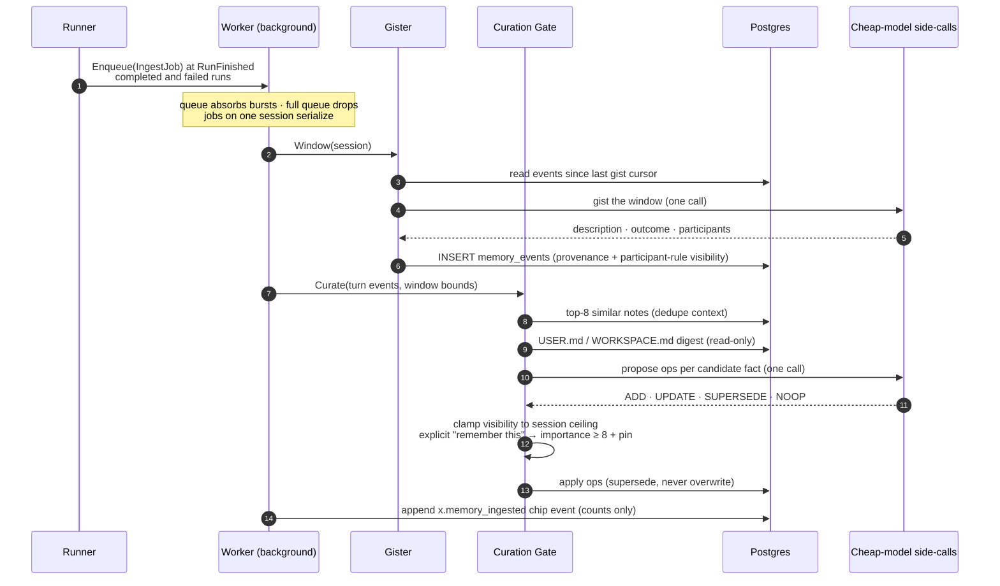
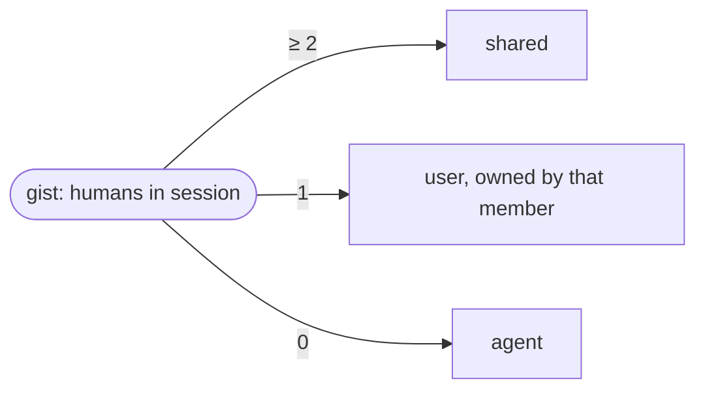
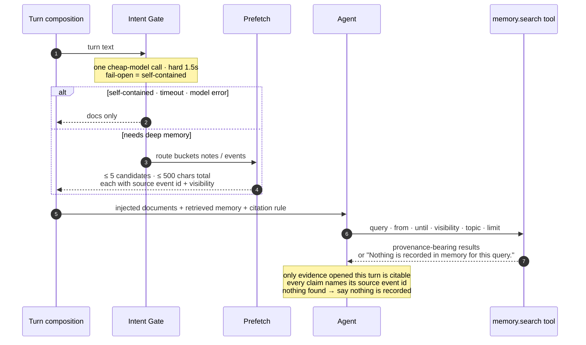
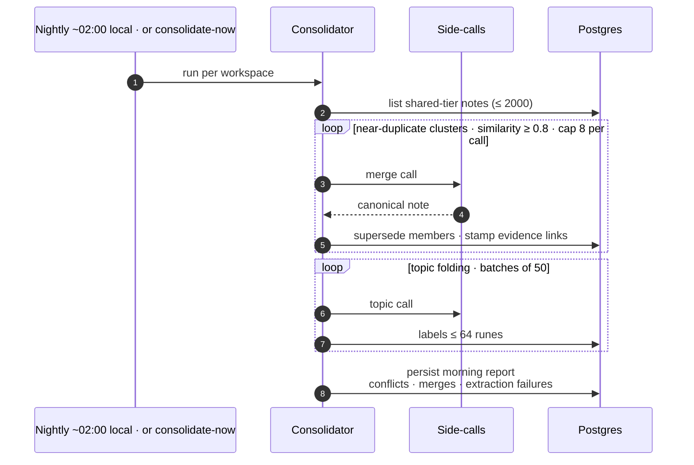
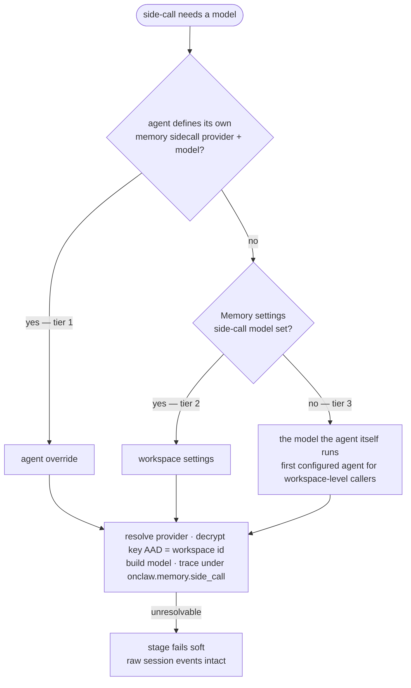
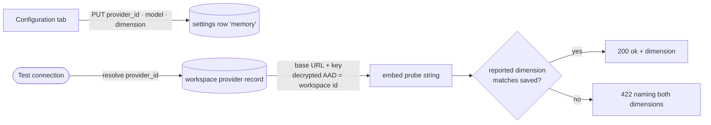

# Memory System

Two memory tiers answer two different needs: the **kept documents** are the
manually curated, always-injected tier; the **extracted stores** are derived
from conversation history by a background pipeline and read on demand.
Architecture from Agent Zero Memory (arXiv 2608.29606) on OnClaw's substrate:
`session_events` as raw evidence, Postgres as the store, `RunFinished` as the
trigger, cheap-model side-calls for every pipeline LLM call.

Guarantees baked into the design: ingestion is off the hot path and never
fails a run; nothing is overwritten or erased (supersede + tombstone);
visibility is structural in the query layer, never prompt-policed; documents
outrank extracted notes.

## Component architecture

```mermaid
flowchart TB
    classDef onclaw fill:#eef4ff,stroke:#2f6feb
    classDef store fill:#f0faf0,stroke:#2f9e44
    classDef side fill:#fff7e8,stroke:#d97706
    classDef ui fill:#fdf0f6,stroke:#c2255c

    subgraph RUNNER["Runner · internal/agents"]
        COMPOSE["composeMemoryDocs<br/>intent gate → prefetch injection"]:::onclaw
        ENQUEUE["enqueueTurnIngest<br/>RunFinished · completed + failed"]:::onclaw
        CHIP["AppendMemoryChip<br/>x.memory_ingested event + broadcast"]:::onclaw
        MSEARCH["memory.search tool<br/>read-only, identity-bound"]:::onclaw
    end

    subgraph MEM["Memory pipeline · internal/memory"]
        WORKER["Worker<br/>queue 256 · concurrency 2<br/>per-session serialization"]:::onclaw
        GISTER["Gister<br/>per-run windowed gist"]:::onclaw
        GATE["Curation Gate<br/>ADD / UPDATE / SUPERSEDE / NOOP<br/>dedupe-before-write"]:::onclaw
        INTENT["IntentGate<br/>hard 1.5s · fail-open"]:::onclaw
        SEARCHER["Searcher<br/>hybrid lexical · zero model calls"]:::onclaw
        CONSOL["Consolidator<br/>nightly ~02:00 local<br/>merge · topics · report"]:::onclaw
    end

    subgraph LLM["Side-calls (providers pattern · Langfuse-traced · fail-soft)"]
        SC1["gister model"]:::side
        SC2["gate model"]:::side
        SC3["intent model"]:::side
        SC4["consolidator models"]:::side
    end

    subgraph PG["Postgres"]
        SE[("session_events<br/>raw evidence")]:::store
        ME[("memory_events<br/>episodic gists")]:::store
        MN[("memory_notes<br/>curated facts")]:::store
        MNE[("memory_note_evidence")]:::store
        MR[("memory_reports<br/>last morning report")]:::store
        DOCS[("user_memories + workspaces<br/>kept documents")]:::store
        TS[("workspace_tool_settings<br/>row key 'memory'")]:::store
    end

    subgraph WEB["Memory pane · Settings → Memory"]
        TABS["Facts · Report · Configuration"]:::ui
    end

    COMPOSE --> INTENT
    INTENT --> SC3
    COMPOSE --> SEARCHER
    MSEARCH --> SEARCHER
    SEARCHER --> MN
    SEARCHER --> ME

    ENQUEUE -->|"IngestJob"| WORKER
    WORKER --> GISTER
    WORKER --> GATE
    GISTER -->|"window"| SE
    GISTER --> SC1
    GISTER -->|"one gist row"| ME
    GATE -->|"turn events + top-8 similar"| SC2
    GATE -->|"ops"| MN
    GATE -.->|"doc digest, read-only"| DOCS
    COMPOSE -.->|"always injected"| DOCS
    WORKER -->|"chip payload"| CHIP
    CHIP -->|"x.memory_ingested"| SE

    CONSOL -->|"cluster + fold"| SC4
    CONSOL --> MN
    CONSOL --> MNE
    CONSOL --> MR
    TABS -->|"notes · events · report · settings"| MN
```

## Data model

Migrations `000054_memory_stores`, `000056_memory_evidence_reports`,
`000057_agent_memory_sidecall` (000055 dropped the legacy
`agent_daily_memories` daily-log tier this pipeline replaces).

The provenance tuple `(origin, event_time, learned_at, source_event_id)` is
NOT NULL on every row — no backfill path exists. Pipeline writes are always
`dialogue`-provenanced: extraction can never mint `manual`.

## Ingestion pipeline

| Op | Meaning |
|---|---|
| `ADD` | New fact (refused when too similar to an existing note) |
| `UPDATE` / `SUPERSEDE` | Correction — new note superseding the targeted one |
| `NOOP` | Trivial, transient, or unusable material |

One malformed op is skipped individually — never rejects the batch. An
explicit user "remember this" marks the note importance ≥ 8 and
pin-eligible; a fact contradicting the documents is stored with the
`doc-conflict` flag instead of touching them. The chip carries counts only,
never content — channels disclose private extractions without revealing
them. Scheduled and heartbeat runs never emit chips.

## Visibility model

The human count resolves at enqueue time from session shape: channel runs
read the roster; Telegram/WhatsApp DMs count one human only when the sender
maps to a member (unmapped or group-origin senders count zero — external
membership never widens a workspace tier). The workspace **posture** switch
(`narrow` default, `org-shared`) raises only the gate's *default* proposal to
`shared`, never past the ceiling. **Only humans widen** (promotion, audited
in `promoted_by`/`promoted_at`); nothing narrows silently. Reads compute the
visible set from the caller: shared + own-user + serving-agent rows — no
query argument can widen it.

## Retrieval

`memory.search` is the only memory tool over the extracted stores:
read-only, zero model calls, identity bound at construction from the run's
`ToolContext` (arguments carry no identity fields; `visibility` can only
narrow). Scheduler/heartbeat origins, `/compact`, and empty turns skip the
gate entirely. The tool registers only when the composition root wires the
searcher — unwired deployments surface no tool at all, not a broken one.

## Consolidator and morning report

Copy-out only: per-owner (user/agent) notes are never folded — collapsing
them into another owner's view would be the one widening the design forbids.
The consolidator holds no document store at all, so it structurally cannot
write the kept documents. The report's extraction-failure count is the delta
of the worker's `Failed` counter since the last pass — silence is never
mistaken for success.

## Side-call model resolution

## Workspace settings

Stored as the structured workspace tool-settings row with key `memory`
(absence = defaults). Managed in **Settings → Memory → Configuration**.

| Setting | Values | Effect |
|---|---|---|
| Visibility posture | `narrow` (default) · `org-shared` | The gate's default proposed tier; ceilings still clamp |
| Ingestion toggle | on (default) / off | Turn-end extraction on/off |
| Side-call model | provider + model via the catalog combobox | Tier 2 of the resolution chain above |
| Embedding model | workspace provider + model + dimension | Saved and connection-tested; **vectors themselves are wave 3** — lexical-only today |

The embedding config is provider-driven: the user picks a workspace provider
from the dropdown and the endpoint and credential resolve from that record at
call time — the settings record stores only provider/model/dimension.
Unknown-provider and missing-model saves are 400s.

## API surface

All under `/api/v1/workspaces/{workspace}` (settings-mutating routes require
`WorkspaceWrite`):

| Route | Purpose |
|---|---|
| `GET / PUT /memory` | Workspace `WORKSPACE.md` document (32k-char cap; 422 over cap) |
| `GET / PUT /me/memory` | Caller's `USER.md` document |
| `GET /memory/notes` | Curated notes — `q`, `visibility`, `topic`, time window, `include_tombstoned` filters + visibility counts |
| `GET /memory/notes/:id` | One note with provenance |
| `POST /memory/notes/:id/promote` | Human visibility widening (audited) |
| `DELETE /memory/notes/:id` | Tombstone delete |
| `GET /memory/events` | Episodic gist timeline |
| `POST /memory/consolidate` | Consolidate now |
| `GET /memory/report` | Last morning report (empty shape: `generated_at: null`, zero counts) |
| `GET / PUT /memory/settings` | The settings record above |
| `POST /memory/settings/test` | Embedding connection test |

The UI (`web/src/screens/settings/MemoryPane.tsx`) presents everything as one
page with three tabs — **Facts** (notes + events browser, promotion, delete),
**Report**, **Configuration** — stating the precedence rule in copy.

## Evaluation

The wave-0 harness (`internal/memory/eval`, CLI `go run . eval-memory`)
seeds a workspace with LongMemEval-protocol scenarios against a running
server and scores recall, citation, and scope behavior — the scoreboard every
capability wave is measured against, and the gate for wave-3's vector
investment (`pgvector` + the dimension-menu columns sketched in the design's
D16; lexical-only is fully functional without them).

## Design references

- Change: `openspec/changes/integrate-agent-zero-memory/` (proposal, design
  D1–D16, specs `agent-memory-pipeline` / `agent-memory-retrieval` /
  `agent-memories`, per-paper diagrams).
- Research: `docs/memory-papers-survey.md`.
- Implementation: `internal/memory/` (worker, gister, gate, intent, searcher,
  consolidator, report, eval); runner seams in
  `internal/agents/runner.go` (`composeMemoryDocs`, `enqueueTurnIngest`,
  `AppendMemoryChip`); tools in `internal/agents/tools/memory.go`; HTTP in
  `internal/server/handlers/memory_notes.go`.
