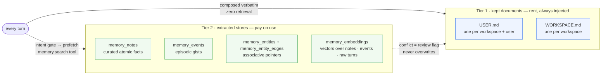
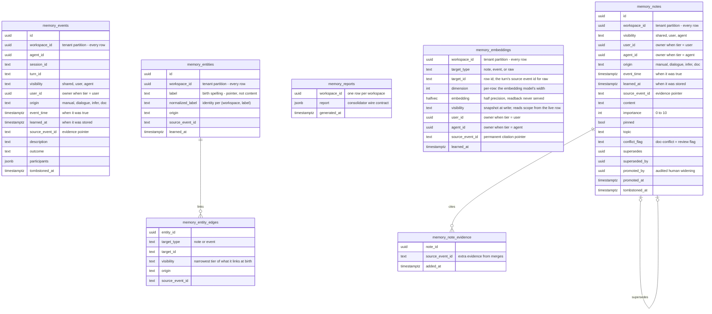
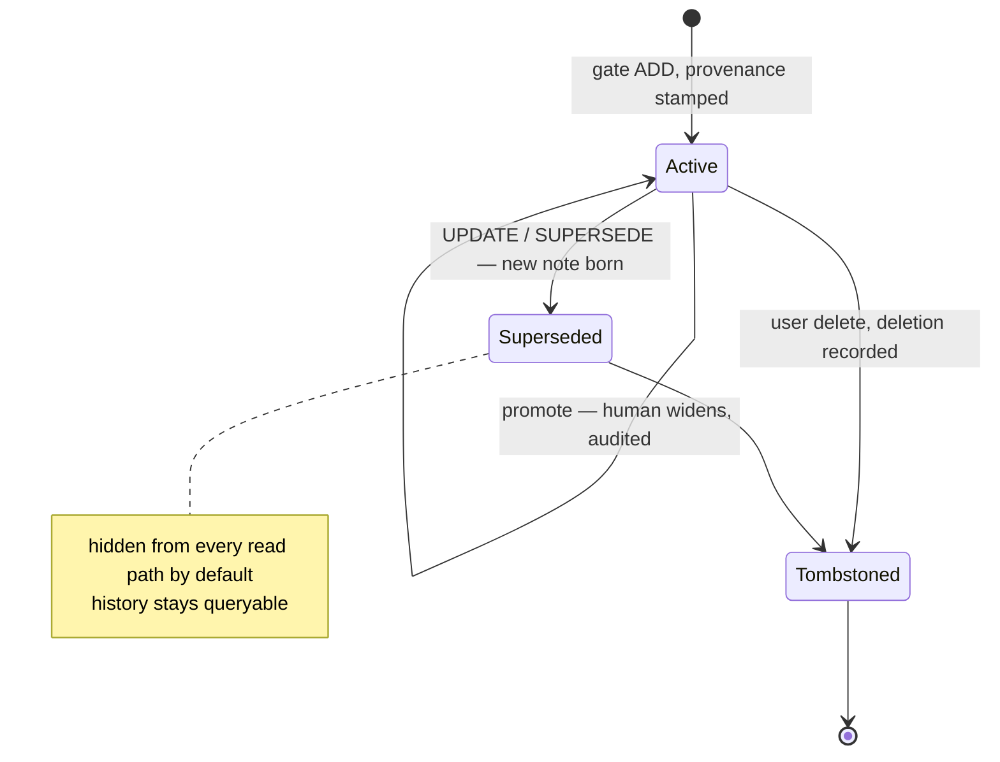
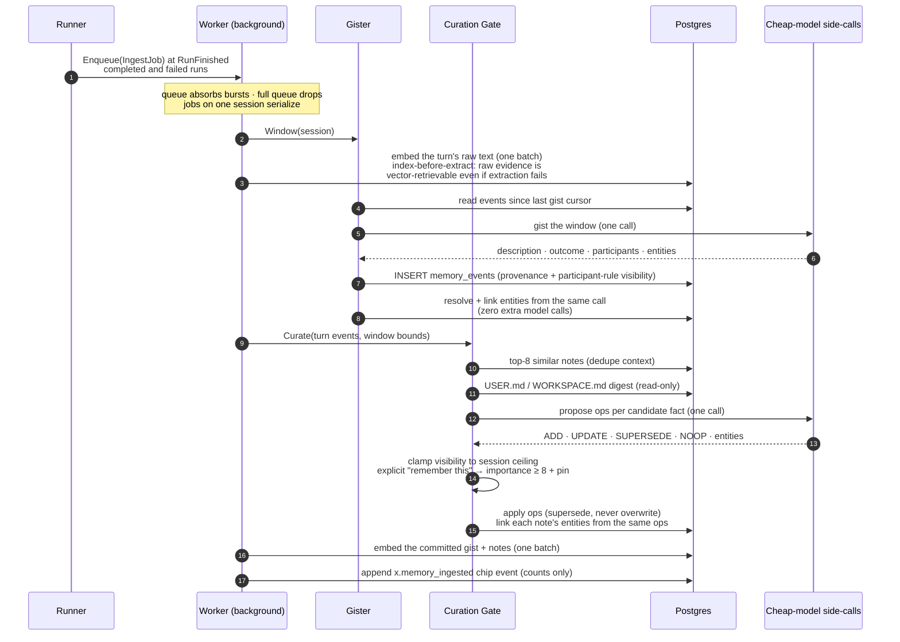
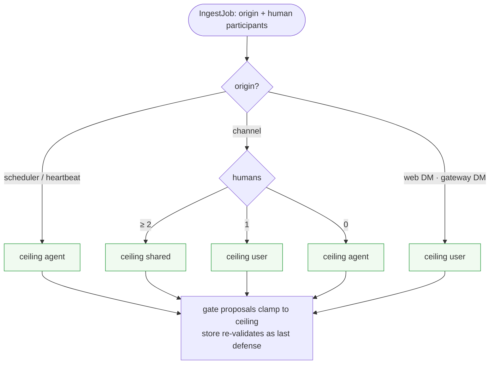
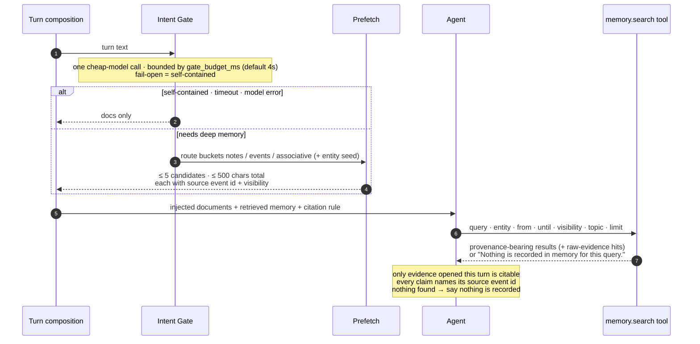
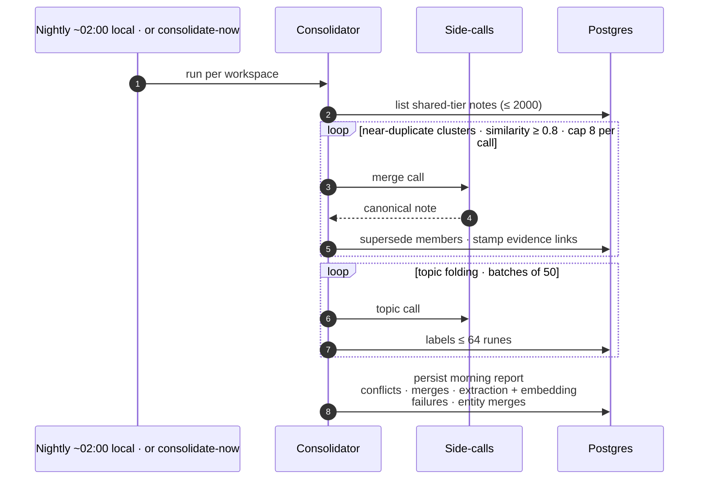

# Memory System

Two memory tiers answer two different needs: the **kept documents** are the
manually curated, always-injected tier; the **extracted stores** are derived
from conversation history by a background pipeline and read on demand.
Architecture from Agent Zero Memory (arXiv 2608.29606) on OnClaw's substrate:
`session_events` as raw evidence, Postgres as the store, `RunFinished` as the
trigger, cheap-model side-calls for every pipeline LLM call. Wave 3 added the
paper's remaining stores: the **vector index** over notes, events, and raw
turns (index-before-extract — the raw turn is embedded before extraction ever
runs) and the **associative graph** of entity pointers and edges. Everything
new is additive and fail-soft: the two embedding stages no-op quietly without
a configured embedding model — the world stays byte-identical to the
lexical-only pipeline — and entity proposals ride the extraction side-calls
that run anyway, costing zero additional model calls.

Guarantees baked into the design: ingestion is off the hot path and never
fails a run; nothing is overwritten or erased (supersede + tombstone);
visibility is structural in the query layer, never prompt-policed; documents
outrank extracted notes.

## Component architecture

```mermaid
flowchart TB
    classDef onclaw fill:#eef4ff,stroke:#2f6feb
    classDef store fill:#f0faf0,stroke:#2f9e44
    classDef side fill:#fff7e8,stroke:#d97706
    classDef ui fill:#fdf0f6,stroke:#c2255c

    subgraph RUNNER["Runner · internal/agents"]
        COMPOSE["composeMemoryDocs<br/>intent gate → prefetch injection"]:::onclaw
        ENQUEUE["enqueueTurnIngest<br/>RunFinished · completed + failed"]:::onclaw
        CHIP["AppendMemoryChip<br/>x.memory_ingested event + broadcast"]:::onclaw
        MSEARCH["memory.search tool<br/>read-only, identity-bound"]:::onclaw
    end

    subgraph MEM["Memory pipeline · internal/memory"]
        WORKER["Worker<br/>queue 256 · concurrency 2 · per-session serialization<br/>stage order: raw-embed → gist → gate → row-embed"]:::onclaw
        GISTER["Gister<br/>per-run windowed gist"]:::onclaw
        GATE["Curation Gate<br/>ADD / UPDATE / SUPERSEDE / NOOP<br/>dedupe-before-write"]:::onclaw
        EMBED["Embedder<br/>openai-compatible embeddings lane<br/>fail-soft · no model configured = silent no-op"]:::onclaw
        INTENT["IntentGate<br/>budget gate_budget_ms · fail-open"]:::onclaw
        SEARCHER["Searcher<br/>RRF fusion: lexical + vector + traversal<br/>zero model calls"]:::onclaw
        CONSOL["Consolidator<br/>nightly ~02:00 local<br/>merge · topics · entity fold · report"]:::onclaw
    end

    subgraph LLM["Side-calls (providers pattern · Langfuse-traced · fail-soft)"]
        SC1["gister model"]:::side
        SC2["gate model"]:::side
        SC3["intent model"]:::side
        SC4["consolidator models"]:::side
    end

    subgraph PG["Postgres"]
        SE[("session_events<br/>raw evidence")]:::store
        ME[("memory_events<br/>episodic gists")]:::store
        MN[("memory_notes<br/>curated facts")]:::store
        MNE[("memory_note_evidence")]:::store
        VEC[("memory_embeddings<br/>vector index: note · event · raw")]:::store
        ENT[("memory_entities +<br/>memory_entity_edges")]:::store
        MR[("memory_reports<br/>last morning report")]:::store
        DOCS[("user_memories + workspaces<br/>kept documents")]:::store
        TS[("workspace_tool_settings<br/>row key 'memory'")]:::store
    end

    subgraph WEB["Memory pane · Settings → Memory"]
        TABS["Facts · Report · Configuration"]:::ui
    end

    COMPOSE --> INTENT
    INTENT --> SC3
    COMPOSE --> SEARCHER
    MSEARCH --> SEARCHER
    SEARCHER --> MN
    SEARCHER --> ME
    SEARCHER --> EMBED
    SEARCHER --> VEC
    SEARCHER --> ENT

    ENQUEUE -->|"IngestJob"| WORKER
    WORKER --> GISTER
    WORKER --> GATE
    WORKER --> EMBED
    EMBED --> VEC
    GISTER -->|"window"| SE
    GISTER --> SC1
    GISTER -->|"one gist row"| ME
    GISTER -->|"resolve + link entities"| ENT
    GATE -->|"turn events + top-8 similar"| SC2
    GATE -->|"ops"| MN
    GATE -->|"resolve + link entities"| ENT
    GATE -.->|"doc digest, read-only"| DOCS
    COMPOSE -.->|"always injected"| DOCS
    WORKER -->|"chip payload"| CHIP
    CHIP -->|"x.memory_ingested"| SE

    CONSOL -->|"cluster + fold"| SC4
    CONSOL --> MN
    CONSOL --> MNE
    CONSOL -->|"FoldEntity"| ENT
    CONSOL --> MR
    TABS -->|"notes · events · report · settings"| MN
```

## Data model

Migrations `000054_memory_stores`, `000056_memory_evidence_reports`,
`000057_agent_memory_sidecall`, `000059_memory_embeddings` (the vector index,
halfvec storage), `000060_memory_entities` (the associative graph)
(000055 dropped the legacy `agent_daily_memories` daily-log tier this
pipeline replaces).

The provenance tuple `(origin, event_time, learned_at, source_event_id)` is
NOT NULL on every row — no backfill path exists. Pipeline writes are always
`dialogue`-provenanced: extraction can never mint `manual`. The wave-3 tables
follow the same discipline: entity rows stamp `(origin, learned_at,
source_event_id)` at birth; embeddings and edges stamp a visibility snapshot
plus the source event id as their permanent citation pointer.

Three structural choices define the graph: **entities are pointers, not
content** — `memory_entities` deliberately has no visibility column, so all
access control lives on the edges and the linked rows, which is what makes
"traversal cannot leak" structural. **Edges inherit the narrowest tier** of
what they link at birth and are never widened afterward — widening happens
only through the human promotion path on the linked row, and edge reads take
scope from the live linked row. **Identity is idempotent**: entity identity
is `(workspace, NormalizeEntityLabel(label))` — trim, lowercase, singular —
so re-resolving the same label yields the same row, and the vector index
upserts per `(workspace, target, dimension)`.

## Ingestion pipeline

| Op | Meaning |
|---|---|
| `ADD` | New fact (refused when too similar to an existing note) |
| `UPDATE` / `SUPERSEDE` | Correction — new note superseding the targeted one |
| `NOOP` | Trivial, transient, or unusable material |

One malformed op is skipped individually — never rejects the batch. An
explicit user "remember this" marks the note importance ≥ 8 and
pin-eligible; a fact contradicting the documents is stored with the
`doc-conflict` flag instead of touching them. The chip carries counts only,
never content — channels disclose private extractions without revealing
them. Scheduled and heartbeat runs never emit chips.

The two embedding stages sandwich extraction — the raw turn before the
gister, the committed gist and notes after the gate — and each stage fails
soft on its own: the raw stage respects the workspace's raw-embedding toggle
(absence = on), entity proposals ride the same side-calls as extraction
(a malformed proposal skips alone, never poisoning its op or the batch), and
every embedding failure logs into the worker's embed-failure counter —
surfaced in the morning report — without blocking any other stage. A
workspace with no embedding model configured skips both stages as a quiet
no-op. A skipped row is lexical-only at worst.

## Visibility model

The human count resolves at enqueue time from session shape: channel runs
read the roster; Telegram/WhatsApp DMs count one human only when the sender
maps to a member (unmapped or group-origin senders count zero — external
membership never widens a workspace tier). The workspace **posture** switch
(`narrow` default, `org-shared`) raises only the gate's *default* proposal to
`shared`, never past the ceiling. **Only humans widen** (promotion, audited
in `promoted_by`/`promoted_at`); nothing narrows silently. Reads compute the
visible set from the caller: shared + own-user + serving-agent rows — no
query argument can widen it.

## Retrieval

`memory.search` is the only memory tool over the extracted stores:
read-only, zero model calls, identity bound at construction from the run's
`ToolContext` (arguments carry no identity fields; `visibility` can only
narrow). Scheduler/heartbeat origins, `/compact`, and empty turns skip the
gate entirely. The tool registers only when the composition root wires the
searcher — unwired deployments surface no tool at all, not a broken one.

Every consumer — turn-time prefetch, the `memory.search` tool, and the notes
API's free-text `q` filter — shares one fused read path over three channels:

- **Lexical channel** — any-term matching: a multi-word query selects rows
  matching any of its sanitized terms, ranked best-match-first by term
  overlap (pins stay dominant on notes), with the exact-substring fallback
  for verbatim identifiers. The floor every other channel degrades to.
- **Vector channel** — the query text is embedded through the workspace's
  embedding lane and the index searched at the returned vector's length,
  which is the configured dimension whenever one is pinned (a batch that
  drifts from it fails at write time, so a mismatched row is never stored).
  Rows embedded at an older dimension are **excluded** by that length — they
  stay lexical-retrievable, are never vector-returned, and are never
  re-embedded or backfilled; pointing the settings at a new model simply
  starts a new dimension. The channel is an enhancement, never a dependency:
  an unconfigured or failing embedder degrades quietly to lexical-only.
- **Traversal channel** — depth-1 entity expansion, zero model calls and
  zero embedding calls: the exact normalized label resolves first, then up
  to 5 prefix/trigram candidates seed the expansion when it misses; the seed
  entities' caller-visible live edges point at linked notes and events, read
  through the same scope-filtered batch reads as every other channel. Depth
  stays 1 — entity → rows; a row mentioning another entity never chains.

Channels fuse with Reciprocal Rank Fusion at k=60: a hit at 1-based rank r
in a channel contributes 1/(60 + r), so fusion is rank-based — no channel
ever needs score calibration against another — and stays dominated by
cross-channel agreement. Each channel returns its own top-k (the query
limit), and a single-channel query degenerates to that channel's own order,
so the lexical-only ordering survives unchanged.

Raw-evidence hits ride alongside the fused notes and events under their own
cap: a raw turn surfaces only when it **leads** the vector ranking — the
best match for the query is the turn itself, typically because extraction
failed or never ran for it. The hit hydrates to the turn's rendered text
from the session event log and cites its source event id under the existing
citation lock; a raw hit has no extracted row of its own, so the source
event id is its whole pointer.

The associative route enters at two places. The intent gate's
`associative` bucket carries an advisory entity seed from the turn, and the
`memory.search` tool accepts an optional `entity` argument (the query is
required unless the entity is provided — a pure entity filter runs pure
traversal). Both feed the same unchanged prefetch budget: at most 5
candidates within a hard 500-char total text budget, **shared** across every
channel — traversal candidates merge with the fused text channels before the
cap is applied, never on top of it.

## Consolidator and morning report

Copy-out only: per-owner (user/agent) notes are never folded — collapsing
them into another owner's view would be the one widening the design forbids.
The consolidator holds no document store at all, so it structurally cannot
write the kept documents. The report's extraction-failure count is the delta
of the worker's `Failed` counter since the last pass — silence is never
mistaken for success.

Wave 3 added the associative hygiene and its counters. Nightly, entity rows
whose normalized labels collide fold onto one deterministic survivor (the
oldest observation wins, id breaking ties): the store's fold re-points every
edge onto the survivor and deletes nothing, so birth provenance and evidence
stamps survive — the folded-duplicate count rides the report as
`entity_merges`. The report also carries `embedding_failures`, the delta of
the worker's embed-failure counter, so a silently degrading vector lane
surfaces in the morning instead of hiding behind a green extraction run.

## Side-call model resolution

## Workspace settings

Stored as the structured workspace tool-settings row with key `memory`
(absence = defaults). Managed in **Settings → Memory → Configuration**.

| Setting | Values | Effect |
|---|---|---|
| Visibility posture | `narrow` (default) · `org-shared` | The gate's default proposed tier; ceilings still clamp |
| Ingestion toggle | on (default) / off | Turn-end extraction on/off |
| Side-call model | provider + model via the catalog combobox | Tier 2 of the resolution chain above |
| Embedding model | workspace provider + model + dimension | The vector channel's write and query embeddings; any positive dimension saves (the API validates positivity) and the connection test discovers the endpoint's true dimension and verifies it against the pin |
| Raw-embedding toggle | on (absence = on) / off | Whether raw turns embed before extraction — the per-workspace storage-pressure switch; notes and events always embed when a model is configured |

The embedding config is provider-driven: the user picks a workspace provider
from the dropdown and the endpoint and credential resolve from that record at
call time — the settings record stores only provider/model/dimension.
Unknown-provider and missing-model saves are 400s, and a supplied dimension
must be a positive integer. The Embedder port re-resolves the pin per call —
credentials stay tenant-scoped and are never cached.

## API surface

All under `/api/v1/workspaces/{workspace}` (settings-mutating routes require
`WorkspaceWrite`):

| Route | Purpose |
|---|---|
| `GET / PUT /memory` | Workspace `WORKSPACE.md` document (32k-char cap; 422 over cap) |
| `GET / PUT /me/memory` | Caller's `USER.md` document |
| `GET /memory/notes` | Curated notes — `q`, `visibility`, `topic`, time window, `include_tombstoned` filters + visibility counts |
| `GET /memory/notes/:id` | One note with provenance |
| `POST /memory/notes/:id/promote` | Human visibility widening (audited) |
| `DELETE /memory/notes/:id` | Tombstone delete |
| `GET /memory/events` | Episodic gist timeline |
| `POST /memory/consolidate` | Consolidate now |
| `GET /memory/report` | Last morning report (empty shape: `generated_at: null`, zero counts) |
| `GET / PUT /memory/settings` | The settings record above |
| `POST /memory/settings/test` | Embedding connection test |

The UI (`web/src/screens/settings/MemoryPane.tsx`) presents everything as one
page with three tabs — **Facts** (notes + events browser, promotion, delete),
**Report**, **Configuration** — stating the precedence rule in copy.

## Evaluation

The harness (`internal/memory/eval`, CLI `go run . eval-memory`) seeds a
workspace with scripted sessions against a running server, drives the
questions through the real chat path (`POST /v1/responses`, live model
keys), and scores recall, update, temporal, multihop, abstention, scope, and
citation behavior.

The standing protocol is the **hardened fixture**
(`openspec/changes/harden-memory-eval-multihop/`): 30 sessions / 75 turns /
28 questions (10 multihop, 12 recall, 1 update, 2 temporal, 2 abstention,
1 scope), scored under a **pre-registered decision rule** — the verdict band
for each category is written down before the run, never chosen after seeing
the numbers. `hardened-run.md` in that change folder is the standing gate
record; every capability wave is measured against it.

**The D11 override (recorded).** The pre-registered rule's multihop verdict
on the hardened run would have permanently closed the graph work. Wave 3
(`openspec/changes/wave3-memory-vectors-and-graph/`) proceeded anyway as a
product decision — the source paper's three parallel stores plus
index-before-extract, shipped as the completeness milestone — with the
hardened fixture as its acceptance instrument: post-wave-3 must score
associative (multihop) ≥ the pre-wave-3 baseline with **no regression** in
recall / update / temporal / abstention / scope.

Pre-wave-3 hardened baseline (run `eval-20260920-134948`, lexical-only, no
embedding model configured):

| category | baseline |
|---|---|
| multihop | 9/10 — 90% |
| recall | 10/12 strict — 83.3% |
| update | 1/1 |
| temporal | 2/2 |
| abstention | 1/2 |
| scope | 1/1 + audit PASS |
| citation_valid | 100% |
| overall | 88.7% |

### Post-wave-3 scoreboard delta

Run pair: `harden-memory-eval-multihop` eval-20260920-134948 (baseline,
lexical-only) vs `wave3-memory-vectors-and-graph` eval-20260920-155925
(vector + graph pipeline live, `nvidia/nemotron-3-embed-1b` @ 2048 dims);
full analysis in each change folder.

| category | baseline | post-wave-3 | delta |
|---|---|---|---|
| multihop (associative) | 9/10 strict — 90% | 9/10 strict — 90% (10/10 lenient arms) | = |
| recall | 10/12 strict — 83.3% (summary 88.0) | 11/12 per-question (summary 92.0) | +1, both baseline strict misses resolved (one lenient-arm residual; grader arm-totals flagged) |
| update | 1/1 | 1/1 | = |
| temporal | 2/2 | 2/2 | = |
| abstention | 1/2 — 66.7% | 2/2 — 100% | +1, no fabricated specifics |
| scope | 1/1 + audit PASS | 1/1 + audit PASS | = |
| citation_valid | 100% | 100% | = |
| overall | 88.7% | 98.0% | +9.3 |

Acceptance per the D11 override — associative ≥ baseline AND no regression
anywhere — **passed**.

## Design references

- Changes: `openspec/changes/integrate-agent-zero-memory/` (proposal, design
  D1–D16, specs `agent-memory-pipeline` / `agent-memory-retrieval` /
  `agent-memories`, per-paper diagrams);
  `openspec/changes/wave3-memory-vectors-and-graph/` (vector + raw-evidence
  index, associative graph, D11 override and hardened baseline);
  `openspec/changes/harden-memory-eval-multihop/` (hardened fixture protocol
  and standing gate record).
- Research: `docs/memory-papers-survey.md`.
- Implementation: `internal/memory/` (worker, embed, gister, gate, entities,
  intent, search, consolidator, report, eval); runner seams in
  `internal/agents/runner.go` (`composeMemoryDocs`, `enqueueTurnIngest`,
  `AppendMemoryChip`); tools in `internal/agents/tools/memory.go`; HTTP in
  `internal/server/handlers/memory_notes.go`; schema in
  `migrations/000059_memory_embeddings` and
  `migrations/000060_memory_entities`.
