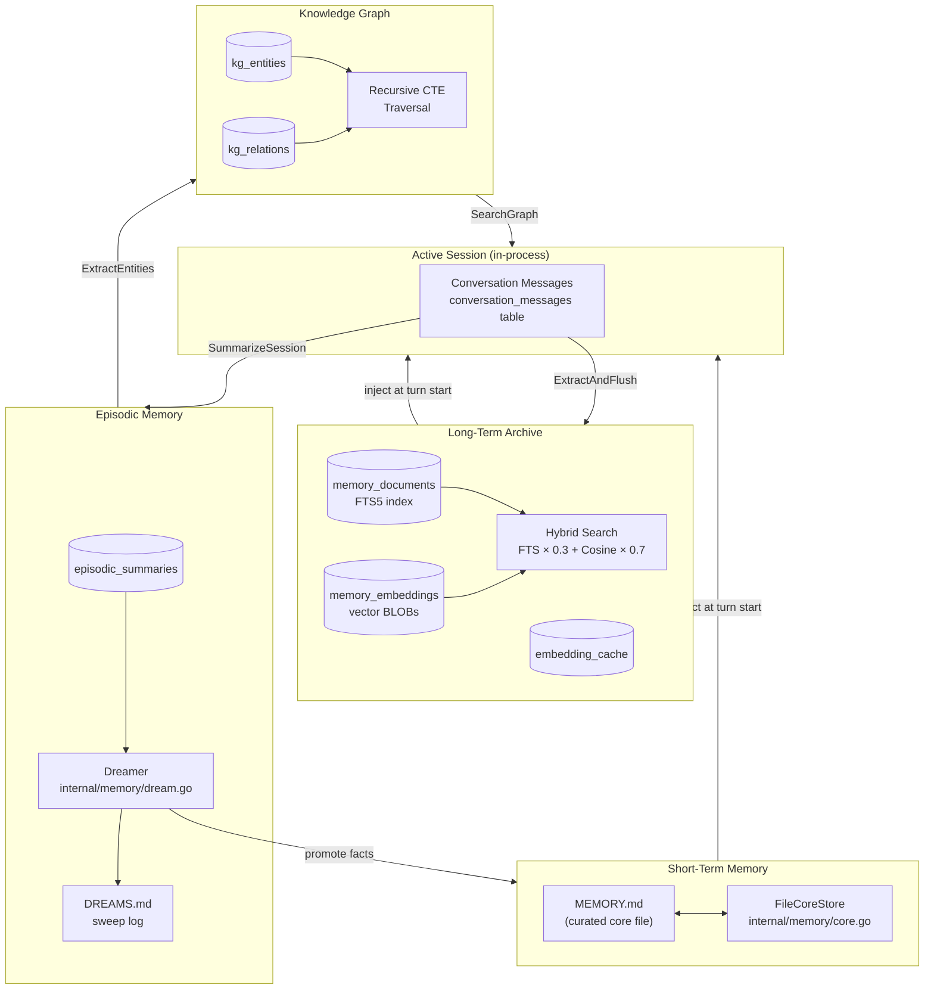
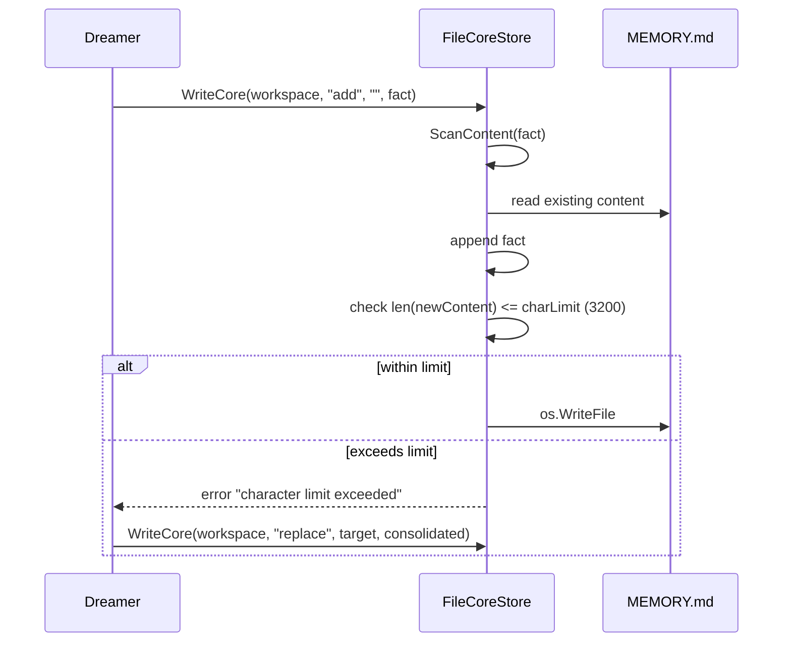
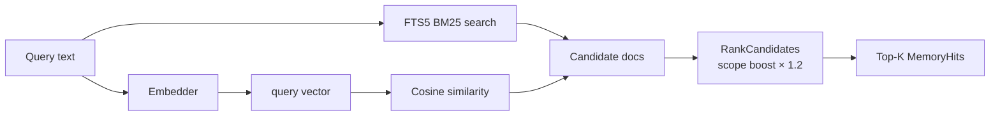
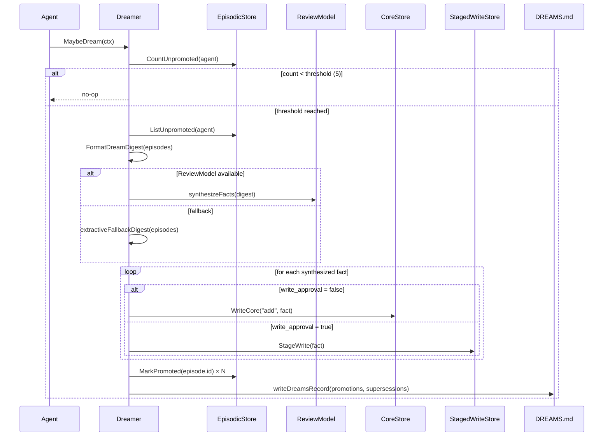
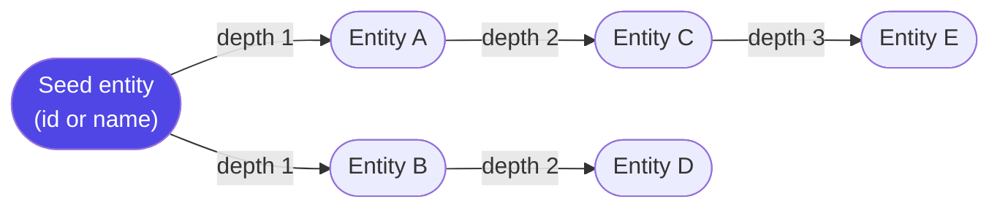
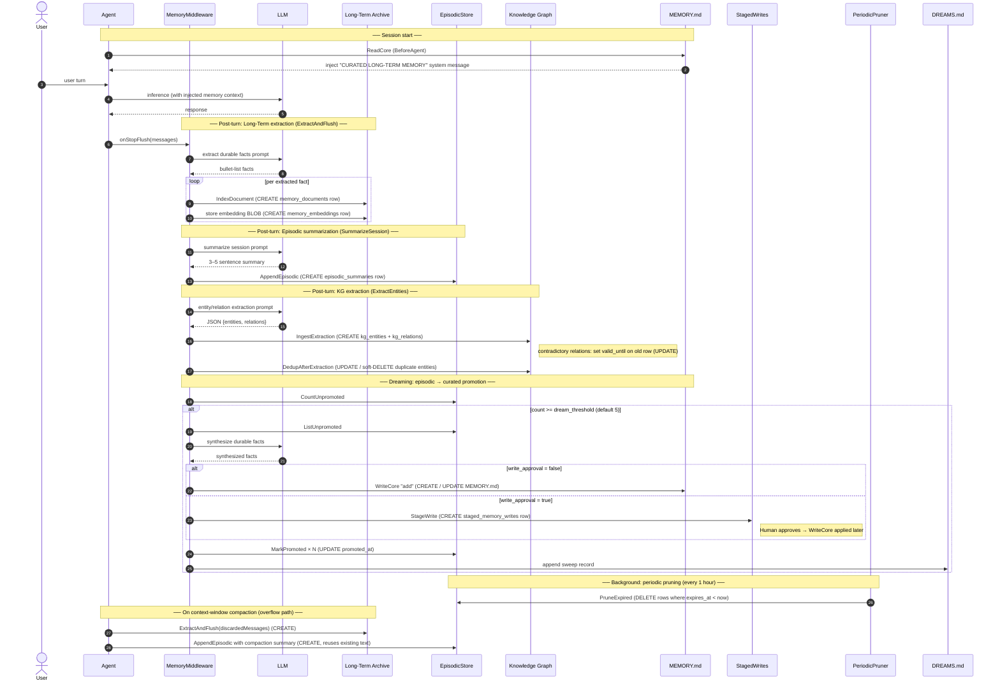
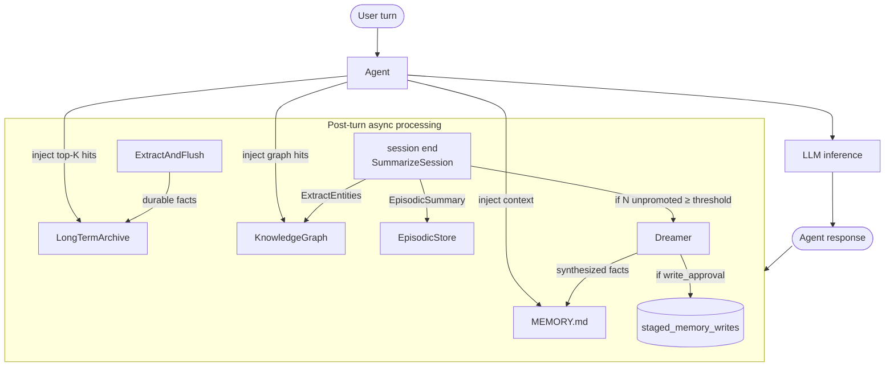

# Memory System

onclaw implements a four-layer memory architecture that persists knowledge across agent sessions. Each layer serves a different time horizon and retrieval pattern, and all four ultimately live in a single SQLite database (`onclaw.db`) under the pure-Go `modernc.org/sqlite` driver.

---

## Overview



---

## Trigger Reference

A quick-lookup table of exactly when each memory layer is written, updated, or deleted.

```mermaid
stateDiagram-v2
    direction LR

    state "Short-Term (MEMORY.md)" as ST
    state "Long-Term Archive" as LT
    state "Episodic Summaries" as EP
    state "Knowledge Graph" as KG

    [*] --> ST : CREATE — Dreamer promotes facts\nor agent calls memory tool
    ST --> ST : UPDATE — replace / remove op\nvia memory tool or Dreamer
    ST --> [*] : DELETE — remove op empties entry

    [*] --> LT : CREATE — ExtractAndFlush\n(per-turn + on compaction)
    LT --> [*] : DELETE — manual via API only

    [*] --> EP : CREATE — FlushMessages on session end\n(EventStop or compaction)
    EP --> EP : UPDATE — MarkPromoted after dreaming
    EP --> [*] : DELETE — PruneExpired every hour\n(expires_at < now)

    [*] --> KG : CREATE — IngestExtraction after each episode
    KG --> KG : UPDATE — DedupAfterExtraction merges duplicates;\nsupersede sets valid_until on old relation
    KG --> [*] : DELETE — entity/relation invalidated by dedup
```



### Per-layer trigger summary

| Layer | CREATE trigger | UPDATE trigger | DELETE trigger |
|-------|---------------|----------------|----------------|
| **Short-Term** (MEMORY.md) | Dreamer promotes N≥threshold facts; agent calls `memory` tool (`add`) | Agent calls `memory` tool (`replace`); Dreamer `consolidateFacts` on cap overflow | Agent calls `memory` tool (`remove`) |
| **Long-Term Archive** | `ExtractAndFlush` — runs on every turn (post-response) and before each context compaction | N/A — documents are immutable; new extraction creates new rows | Manual delete via API (`DeleteDocument`) |
| **Episodic** | `FlushMessages` at session end (EventStop path or compaction callback) | `MarkPromoted` — set after Dreamer processes the episode | `PruneExpired` — background goroutine, runs every hour |
| **Knowledge Graph** | `IngestExtraction` — runs after each episodic write | `DedupAfterExtraction` — merge duplicates; superseded relations get `valid_until` set | Entity/relation `valid_until` set by dedup (soft delete); no hard-delete path |

---

## Layer 1 — Short-Term Memory (Curated Core)

**What it is:** A plain-text file called `MEMORY.md` that lives in the agent's workspace directory. It is the agent's curated, handpicked surface — the facts the agent should always have in mind.

**Files:**
- `internal/memory/core.go` — `FileCoreStore` implementation
- `internal/memory/store.go` — `CoreStore` interface

**How it works:**

`FileCoreStore` exposes three operations on `MEMORY.md`:
- `add` — appends a line
- `replace` — swaps a unique substring
- `remove` — deletes a unique substring

A hard character cap (default **3,200 chars**, ~800 tokens) is enforced on every write. If a promotion from the Dreamer would breach this cap, the system attempts to consolidate the existing content first, then falls back to staging the write for manual approval.

Every write passes through `ScanContent` (see Security below) before being committed to disk.

**Triggers:**

| Event | Operation | Caller |
|-------|-----------|--------|
| Dreamer fires (N unpromoted episodes ≥ threshold) | **CREATE** (add) or **UPDATE** (replace on cap overflow) | `Dreamer.dream()` → `CoreStore.WriteCore` |
| Agent calls `memory` tool with `add` op | **CREATE** | `memoryTool.Build` → `FileCoreStore.WriteCore` |
| Agent calls `memory` tool with `replace` op | **UPDATE** | `memoryTool.Build` → `FileCoreStore.WriteCore` |
| Agent calls `memory` tool with `remove` op | **DELETE** (entry removed from file) | `memoryTool.Build` → `FileCoreStore.WriteCore` |
| Human approves staged write via CLI / Web UI | **CREATE / UPDATE / DELETE** (same ops, deferred) | `memory_cmd.go` → `FileCoreStore.WriteCore` |



**Configuration:**

| Key | Default | Description |
|-----|---------|-------------|
| `memory.char_limit` | `3200` | Max characters in MEMORY.md |
| `memory.write_approval` | `false` | Queue writes as staged instead of direct |

---

## Layer 2 — Long-Term Archive

**What it is:** A searchable archive of durable facts extracted from conversations. Persists indefinitely; retrieved by hybrid FTS + vector similarity search.

**Files:**
- `internal/memory/extract.go` — `ExtractAndFlush` (extraction pipeline)
- `internal/memory/search.go` — `RankCandidates` (hybrid scoring)
- `internal/memory/embedding.go` — `Embedder` (vector embedding with cache)
- `internal/store/sqlite/` — `sqliteMemoryStore` (implementation)

**Schema:**

```
memory_documents          memory_embeddings         embedding_cache
─────────────────         ─────────────────         ───────────────
id (PK)                   document_id (FK→docs)     embedding_model
agent                     vector BLOB               content_hash
scope                                               vector BLOB
kind                                                created_at
content
source
embedding_model
created_at

memory_documents_fts  ← FTS5 virtual table (auto-synced via triggers)
```

**Extraction pipeline (`ExtractAndFlush`):**

1. A cursor stored in the KV store (`memory_cursor:<conversation_id>`) tracks which messages have already been processed.
2. New messages since the last cursor are sent to the LLM with a prompt to extract durable facts (user preferences, project decisions, recurring patterns).
3. If the LLM is unavailable, an extractive fallback scans for keyword triggers (`prefer`, `always`, `remember`, `must`, `should`, `need`, `decide`).
4. Each extracted fact is security-scanned, embedded via the `Embedder`, and inserted into `memory_documents` + `memory_embeddings`.

**Triggers:**

| Event | Operation | Caller |
|-------|-----------|--------|
| End of every agent turn (response completed) | **CREATE** — new `memory_documents` rows per extracted fact | `EventStop` → `onStopFlush` → `FlushMessages` → `ExtractAndFlush` |
| Context-window compaction (messages being discarded) | **CREATE** — extracts from about-to-be-dropped messages before they leave context | `CompactMessages` in `agent.go` → `ExtractAndFlush` on `discardedMessages` |
| Agent calls `memory_search` tool | Read-only — no write | `memorySearchTool.Build` → `MemoryStore.SearchArchive` |
| Manual delete via API | **DELETE** — hard removal of a document row | `MemoryStore.DeleteDocument` |

**Hybrid search:**

Retrieval blends FTS5 (BM25) and cosine similarity with configurable weights:

```
score = fts_weight × BM25_normalized + vector_weight × cosine_normalized
```

Default: **30% FTS / 70% vector**. When no embedding provider is configured, the system falls back to FTS-only.



**Configuration:**

| Key | Default | Description |
|-----|---------|-------------|
| `memory.embedding_provider` | `""` | Provider name (`openai`, `gemini`, `ollama`, …) |
| `memory.embedding_model` | `""` | Model name for embeddings |
| `memory.fts_weight` | `0.3` | BM25 weight in hybrid score |
| `memory.vector_weight` | `0.7` | Cosine weight in hybrid score |

---

## Layer 3 — Episodic Memory

**What it is:** Per-session summaries. Each completed session is distilled into a 3–5-sentence `summary`, a one-line `l0_abstract`, and a comma-separated `key_topics` list. Rows expire after a configurable TTL (default 90 days).

**Files:**
- `internal/memory/episodic.go` — `SummarizeSession`, `FormatDreamDigest`
- `internal/memory/dream.go` — `Dreamer`, `PeriodicPruner`
- `internal/store/sqlite/episodic.go` — `sqliteEpisodicStore`

**Schema:**

```
episodic_summaries
──────────────────
id (PK)
agent
summary           ← 3–5 sentence LLM or compaction summary
l0_abstract       ← first sentence, max 160 chars (extractive)
key_topics        ← comma-separated capitalized phrases (extractive)
source_id         ← conversation ID (unique per agent)
promoted_at       ← NULL until the Dreamer processes this row
expires_at        ← NOW + episodic_ttl_days
created_at
```

**Summarization (`SummarizeSession`):**

- If a compaction summary already exists (from a previous context-window rollup), it is reused without an extra LLM call.
- Otherwise, a single LLM call produces the `summary`.
- `l0_abstract` and `key_topics` are always computed extractively (no LLM call).

**Triggers:**

| Event | Operation | Caller |
|-------|-----------|--------|
| Session ends normally (iterator exhausted) | **CREATE** — new `episodic_summaries` row | `EventStop` → `onStopFlush` → `FlushMessages` → `SummarizeSession` → `AppendEpisodic` |
| Context-window compaction (messages discarded) | **CREATE** — episode written using the compaction summary text (no second LLM call) | `CompactMessages` callback → `FlushMessages(compactionSummary)` → `AppendEpisodic` |
| Dreamer finishes processing an episode | **UPDATE** — `promoted_at` set to now | `Dreamer.dream()` → `EpisodicStore.MarkPromoted` |
| `PeriodicPruner` fires (every 1 hour) | **DELETE** — rows where `expires_at < now` are removed | `PeriodicPruner.Start` goroutine → `EpisodicStore.PruneExpired` |

**Dreaming pipeline (`Dreamer`):**

The Dreamer is the bridge between episodic and short-term memory. It fires when the count of unpromoted episodes for an agent reaches `dream_threshold` (default 5), subject to a debounce of 10 minutes.



A `PeriodicPruner` goroutine calls `PruneExpired` every hour to delete rows whose `expires_at` has passed.

**Configuration:**

| Key | Default | Description |
|-----|---------|-------------|
| `memory.dream_threshold` | `5` | Unpromoted episodes needed to trigger dreaming |
| `memory.episodic_ttl_days` | `90` | Days before an episodic summary expires |
| `memory.review_model` | `""` | LLM used to synthesize facts (empty = same model) |

---

## Layer 4 — Knowledge Graph

**What it is:** A temporal, directed entity-relation graph. LLM extraction turns episodic summaries into typed entities (Person, Project, Concept, Technology, …) and labeled edges (works_on, uses, depends_on, …). Contradictory relations are superseded rather than deleted — old rows get a `valid_until` timestamp, preserving full history.

**Files:**
- `internal/memory/entity_extract.go` — `ExtractEntities`, `ExtractEntitiesWithSecurity`
- `internal/memory/kg_types.go` — `Entity`, `Relation`, `Extraction`, `KGQuery`, `KGHit`
- `internal/memory/kg_store.go` — `KGStore` interface
- `internal/store/sqlite/knowledge_graph.go` — `sqliteKGStore` (ingest, dedup, traversal)

**Schema:**

```
kg_entities                  kg_relations
───────────                  ────────────
id (PK)                      id (PK)
type   ← Person/Concept/…    from_entity (FK→entities)
name   ← normalized          to_entity   (FK→entities)
agent                        predicate   ← works_on / uses / …
valid_from                   agent
valid_until ← NULL = current valid_from
                             valid_until ← NULL = current
```

**Ingestion (`IngestExtraction`):**

1. LLM produces JSON `{ entities: [{type, name}], relations: [{from, predicate, to}] }`.
2. Entity names are normalized (lowercase + trim).
3. Relation endpoints are resolved by name; unknown names create new `Unknown`-typed entities.
4. Existing current relations between the same endpoints are superseded (set `valid_until = now`) before the new relation is inserted.

**Triggers:**

| Event | Operation | Caller |
|-------|-----------|--------|
| Episodic row written (after session end) | **CREATE** — new `kg_entities` + `kg_relations` rows | `FlushMessages` → `extractAndIngestEntities` → `IngestExtraction` |
| After each `IngestExtraction` call | **UPDATE** — duplicate entities merged; stale entities/relations get `valid_until` set | `extractAndIngestEntities` → `DedupAfterExtraction` |
| New relation contradicts an existing one | **UPDATE** — old relation's `valid_until` set to now; new row inserted | `IngestExtraction` (supersession logic in transaction) |
| Agent calls `kg_search` tool | Read-only — no write | `KGSearchTool.Build` → `KGStore.SearchGraph` |

**Deduplication (`DedupAfterExtraction`):**

After ingestion, the system merges entities with the same `(agent, type, normalized_name)`. The oldest entity becomes canonical; all relations pointing to duplicates are re-pointed and the duplicate entities are invalidated.

Entities with the same name but different types are left separate — they may be genuinely distinct (e.g. "Apple" as Organization vs. Concept) and require human review to resolve.

**Graph traversal (`SearchGraph`):**

Retrieval uses a recursive CTE that walks `kg_relations` up to `kg_traversal_depth` hops from a seed entity:



Each `KGHit` includes the entity, the full path of relations from seed to that entity, and the hop distance.

**Configuration:**

| Key | Default | Description |
|-----|---------|-------------|
| `memory.kg_enabled` | `true` | Enable the knowledge graph layer |
| `memory.kg_traversal_depth` | `3` | Maximum hops in graph traversal |

---

## Memory Lifecycle: Detailed Sequence

The diagram below shows the complete lifecycle from a user turn through all four memory layers, including every trigger point.



---

## Data Flow: End-to-End



---

## Staged Writes (Approval Workflow)

When `memory.write_approval = true`, the Dreamer does not write directly to `MEMORY.md`. Instead it enqueues a row in `staged_memory_writes` with `status = "pending"`. A human operator (or the Web UI) can then approve or reject each pending write.

```
staged_memory_writes
────────────────────
id (PK)
agent
operation  ← "add" | "replace" | "remove"
target
content
status     ← "pending" | "approved" | "rejected"
created_at
```

---

## Security

All content entering `MEMORY.md` or the long-term archive passes through `ScanContent` (`internal/memory/security.go`). It blocks:

- **Invisible Unicode / direction-override characters** (U+200B–U+200F, U+202A–U+202E, U+FEFF)
- **Prompt injection patterns** (`ignore previous instructions`, `you are now a`, `system prompt`, `developer mode`, `assistant bypass`)
- **Credential patterns** (OpenAI `sk-`, Google `AIzaSy`, Groq `gsk_`, and generic `api_key=…` patterns)

KG entity extraction additionally scans every entity name, type, and relation predicate before ingestion.

---

## Configuration Reference

All keys live under the `memory` namespace in `.env` (or `ONCLAW_MEMORY_*` env vars).

| Key | Type | Default | Description |
|-----|------|---------|-------------|
| `memory.enabled` | bool | `true` | Master switch for the entire memory system |
| `memory.char_limit` | int | `3200` | Max chars in MEMORY.md (~800 tokens) |
| `memory.write_approval` | bool | `false` | Require human approval for Dreamer writes |
| `memory.embedding_provider` | string | `""` | Provider for vector embeddings |
| `memory.embedding_model` | string | `""` | Embedding model name |
| `memory.fts_weight` | float | `0.3` | BM25 weight in hybrid retrieval |
| `memory.vector_weight` | float | `0.7` | Cosine weight in hybrid retrieval |
| `memory.review_model` | string | `""` | Model for dream synthesis (empty = global model) |
| `memory.dream_threshold` | int | `5` | Episodes before dreaming fires |
| `memory.episodic_ttl_days` | int | `90` | Episodic row expiry in days |
| `memory.kg_enabled` | bool | `true` | Enable the knowledge graph |
| `memory.kg_traversal_depth` | int | `3` | Max hops in KG traversal |

Per-agent overrides are stored as JSON in `agents.memory_config` and merged via `AgentMemoryConfig.Resolve()` at runtime. Agent overrides take precedence over the global config; unset fields fall back to the global value.

---

## Key Files at a Glance

| File | Responsibility |
|------|---------------|
| `internal/memory/types.go` | All memory DTOs (`MemoryDocument`, `EpisodicSummary`, `AgentMemoryConfig`, …) |
| `internal/memory/store.go` | Store interfaces (`MemoryStore`, `CoreStore`, `EpisodicStore`, `StagedWriteStore`) |
| `internal/memory/core.go` | `FileCoreStore` — reads/writes `MEMORY.md` with char-cap enforcement |
| `internal/memory/extract.go` | `ExtractAndFlush` — LLM fact extraction → long-term archive |
| `internal/memory/search.go` | `RankCandidates` — hybrid BM25 + cosine scoring |
| `internal/memory/embedding.go` | `Embedder` — SHA-256-cached vector embedding wrapper |
| `internal/memory/episodic.go` | `SummarizeSession`, `FormatDreamDigest` |
| `internal/memory/dream.go` | `Dreamer` (episodic → curated promotion), `PeriodicPruner` |
| `internal/memory/security.go` | `ScanContent` — injection / credential / Unicode scanning |
| `internal/memory/entity_extract.go` | `ExtractEntities` — LLM → KG `Extraction` struct |
| `internal/memory/kg_types.go` | KG types (`Entity`, `Relation`, `Extraction`, `KGQuery`, `KGHit`) |
| `internal/memory/kg_store.go` | `KGStore` interface |
| `internal/store/sqlite/knowledge_graph.go` | SQLite KG: ingest, dedup, recursive CTE traversal |
| `internal/store/sqlite/db.go` | Schema migrations (all 6 memory tables + FTS5 + triggers) |
| `internal/config/config.go` | `MemoryConfig` struct |
| `internal/config/defaults.go` | Memory defaults (conservative 2 GB device baseline) |
